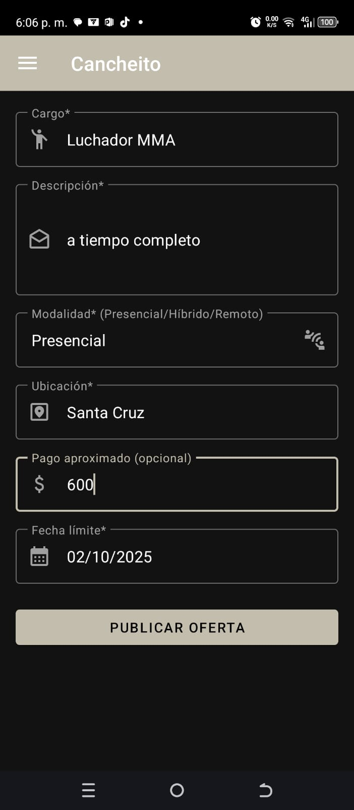
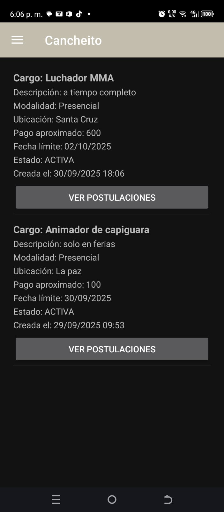
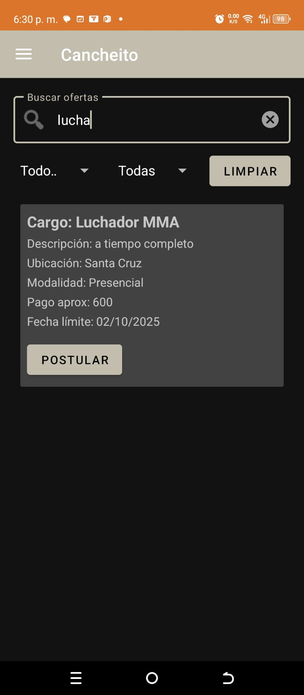
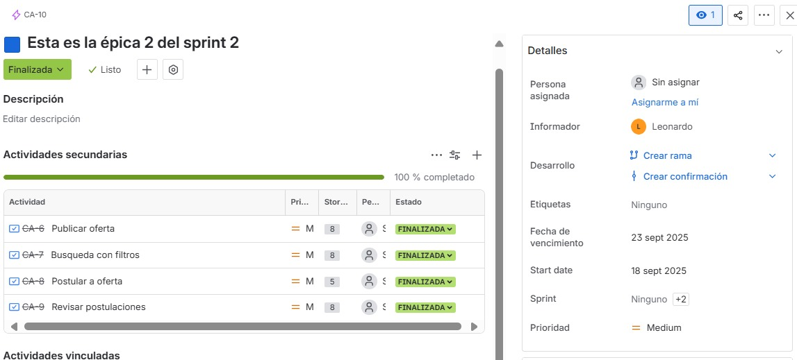
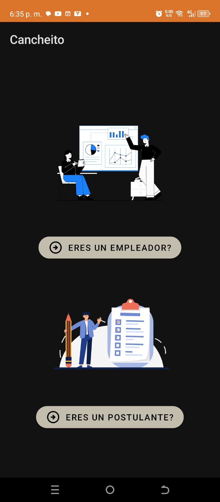
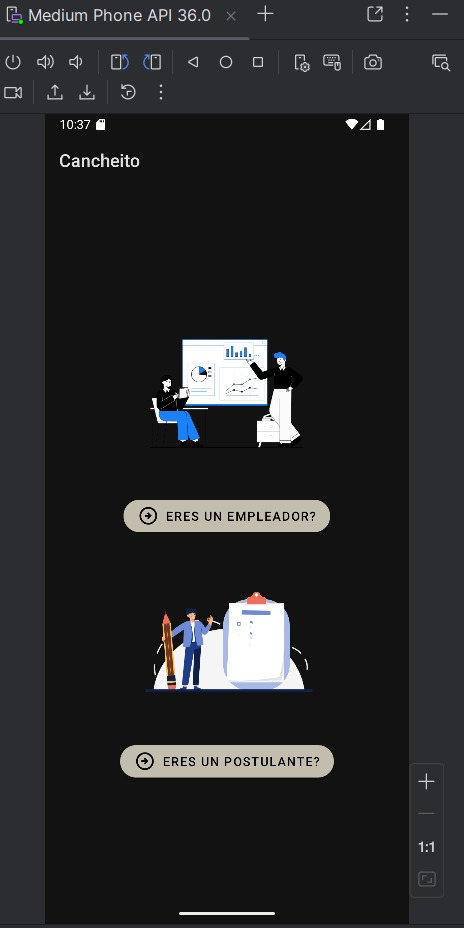

# 📱 Portafolio Digital Personal – Leonardo Fidel Arana Isita

## 📌 Resumen ejecutivo  
Soy **Leonardo Fidel Arana Isita** y participé en el desarrollo del proyecto **Cancheito**, una aplicación móvil nativa en **Kotlin** que conecta postulantes y empleadores.  
El sistema permite **registrarse, crear perfiles, publicar ofertas y postularse a empleos** de manera sencilla y segura.  

Mi contribución principal estuvo enfocada en el módulo de **publicación de ofertas** y en la **implementación de filtros de búsqueda**, logrando que los empleadores gestionen fácilmente sus vacantes y los postulantes encuentren oportunidades relevantes.  

El proyecto siguió una arquitectura **MVVM** con soporte de **Firebase (Auth, Realtime Database, Storage)** y se gestionó bajo la metodología **Scrum**, alcanzando un **MVP funcional** al finalizar el Sprint 2.  

---

## ⚙️ Contribuciones técnicas  

### Tecnologías utilizadas  
- **Frontend / Mobile:** Kotlin (Android Nativo) con Android SDK  
- **Backend:** Firebase Realtime Database, Firebase Authentication, Firebase Storage  
- **Database:** Firebase (persistencia en la nube y sincronización en tiempo real)  
- **Tools:** Android Studio, Git/GitHub, Jira, Miro, Gradle  

### Contribuciones clave del código  
1. Implementación del módulo de **publicación de ofertas laborales** → `OffersViewModelEmpleador.kt`.  
2. Desarrollo de la **búsqueda filtrada de ofertas** con Firebase queries → `OffersViewModel.kt`.  
3. Configuración de **MVVM + LiveData** para un manejo reactivo de la UI.  

### Desafíos técnicos resueltos  
- **Problema:** Dificultad para sincronizar en tiempo real los cambios de ofertas con los filtros activos.  
- **Solución:** Uso de **Firebase queries** y **coroutines** para mantener datos actualizados sin bloquear la UI.  
- **Aprendizaje:** Fortalecí mis conocimientos en **arquitectura MVVM y Firebase Realtime Database**.  

### Creación de servicios  
- Lógica para publicación de ofertas → `OffersViewModelEmpleador.kt`  
- Lógica para filtrado dinámico → `OffersViewModel.kt`  

### Integración con Firebase  
- Autenticación de usuarios con **Firebase Auth**.  
- Gestión de ofertas y perfiles en **Realtime Database**.  
- Almacenamiento de archivos en **Firebase Storage**.  

### Pruebas en dispositivos físicos  
- **Emuladores:** Pixel 5 (API 30), Nexus 6 (API 28).  
- **Dispositivos físicos:** Android 11 y Android 13.  

---

## 🌀 Aplicación de la metodología ágil  
- **Rol ejercido:** Desarrollador Android.  
- **Ceremonias Scrum:** Participé en *Daily Scrum, Sprint Planning, Sprint Review y Sprint Retrospective*.  
- **Métricas de contribución:** Desarrollo del **100% del módulo de publicación y filtrado de ofertas**, correspondientes a las historias de usuario **US-005** y **US-006**.  

---

## 💡 Desarrollo de habilidades blandas  
- **Comunicación:** Mejoré mi claridad al compartir avances y bloqueos en los Daily Scrums.  
- **Liderazgo técnico:** Apoyé al equipo en la integración de Firebase y en buenas prácticas de arquitectura MVVM.  
- **Resolución de problemas:** Logré depurar errores de sincronización y consultas en Firebase.  
- **Adaptabilidad:** Me adapté a cambios de alcance en el backlog sin afectar los plazos del sprint.  

---

## 📂 Artefactos y evidencia  

### Pantallas de la aplicación  
- Publicación de ofertas  
    
    
- Búsqueda filtrada  
    

### Gestión en Jira  
  

### Ejecución en dispositivos  
- Captura en celular  
    
- Android Studio (emulador)  
    

### Fragmentos de código relevantes  

#### 📑 `OffersViewModel.kt` → búsqueda y filtrado dinámico  

```kotlin
package com.example.myappcancheito.postulante.ui

import androidx.lifecycle.*
import com.example.myappcancheito.empleador.ofertas.Offer
import kotlinx.coroutines.*

data class OffersFilter(
    val cargo: String? = null,
    val ciudad: String? = null,
    val query: String? = null
)

class OffersViewModel : ViewModel() {
    private val allOffers = mutableListOf<Offer>()
    private var currentFilter = OffersFilter()

    private val _items = MutableLiveData<List<Offer>>(emptyList())
    val items: LiveData<List<Offer>> = _items

    private val _empty = MutableLiveData(false)
    val empty: LiveData<Boolean> = _empty

    fun applyFilters(filter: OffersFilter) {
        currentFilter = filter
        viewModelScope.launch {
            val filtered = allOffers.filter { matchesFilter(it, filter) }
            _items.value = filtered
            _empty.value = filtered.isEmpty()
        }
    }

    private fun matchesFilter(offer: Offer, f: OffersFilter): Boolean {
        val okCargo = f.cargo?.equals(offer.cargo, ignoreCase = true) ?: true
        val okCiudad = f.ciudad?.equals(offer.ubicacion, ignoreCase = true) ?: true
        val okQuery = f.query?.let { q ->
            val haystack = listOf(
                offer.cargo, offer.descripcion,
                offer.ubicacion, offer.modalidad, offer.pago_aprox
            ).joinToString(" ").lowercase()
            q.lowercase() in haystack
        } ?: true
        return okCargo && okCiudad && okQuery
    }
}
```
## 🔮 Reflexión y crecimiento futuro

- **Autoreflexión:** Reforcé mi experiencia en **Kotlin, Firebase y arquitectura MVVM**, logrando entregar un módulo funcional y escalable.  
- **Plan de crecimiento personal:** Expandir mi conocimiento hacia **Jetpack Compose y Clean Architecture** para mejorar escalabilidad y productividad.  
- **Impacto en visión profesional:** Este proyecto consolidó mi interés en el **desarrollo móvil nativo Android** y me impulsa a seguir especializándome en apps con **Firebase y arquitecturas modernas**.  


